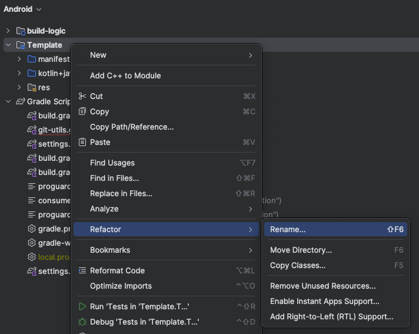
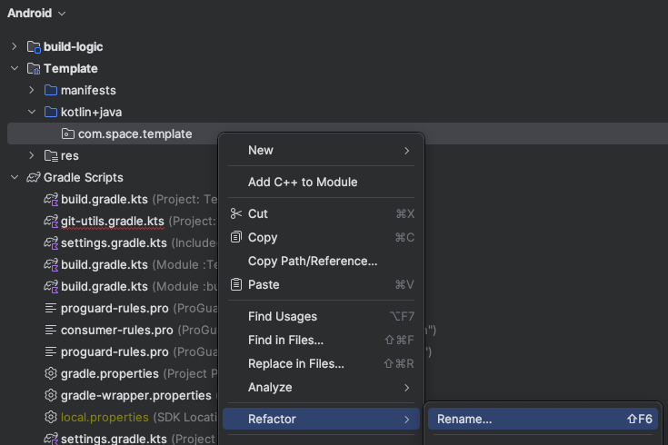

# Space Remote Repositories Template


## Table of Contents

- [Overview](#overview)
- [Features](#features)
- [Installation](#installation)
- [Usage](#usage)
- [Configuration](#configuration)
- [Contributing](#contributing)
- [License](#license)

## Overview

This project serves as an initial template for creating projects in Space Remote repositories. It provides a basic structure and configuration to help you get started quickly.

## Features

- Pre-configured Gradle setup
- Basic module and package structure
- Easy customization for new projects

## Installation

1. **Clone the repository**: Clone it to your local machine.
    ```sh
    git clone https://github.com/nikantro888/Android-Space-Template.git
    ```

## Usage

Follow these steps to set up your project:

### 1. Replace in the Gradle properties

Update the `gradle.properties` file with your project details:

```properties
# Project details
APP_NAME=YourAppName
NAME_SPACE=com.yourcompany.yourapp
```
### 2. Manually replace the package and module names





### 3. Move the target module's functionality !!!


